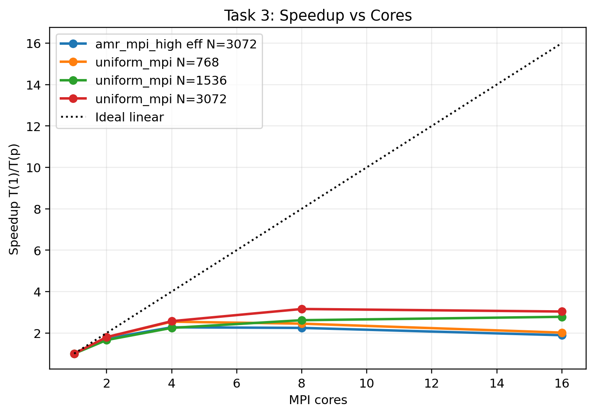

# AMReX Euler AMR/MPI Solver

Finite-volume solver and reproducibility pack for a compressible Euler study using [AMReX](https://github.com/AMReX-Codes/amrex). The project evaluates shock-capturing accuracy, adaptive mesh refinement (AMR), and single-node MPI scaling for one- and two-dimensional Euler benchmarks.

This repository is prepared as a public portfolio version of the assignment work. Private submission records and the local AMReX checkout are intentionally excluded from git.

## Highlights

- Implemented a 2D compressible Euler solver in C++ on AMReX's block-structured AMR framework.
- Used HLL fluxes with Davis wave-speed bounds, MUSCL/minmod reconstruction, SSPRK2 time stepping, refluxing, and density/pressure positivity safeguards.
- Validated against Toro 1D Riemann problems and 2D orientation/diagonal-split extensions.
- Measured AMR and MPI performance on a Lax-Liu-style quadrant benchmark.
- Final repeated Task 3 result: AMR+MPI at `p=4` reduced time-to-solution by `33.33x` versus the repeated uniform `N=3072` serial baseline on the same laptop.
- Report conclusion is deliberately nuanced: AMR delivered strong runtime gains and credible shock-oriented behavior, but full-field diagnostics did not support a blanket matched-spacing AMR accuracy advantage.

## Selected Results

### AMR Runtime Advantage


### MPI Scaling Saturation



### 1D Validation Example


## Repository Layout

```text
code_submission/
  build/                 Minimal AMReX GNU Make build files
  shared_solver/         Final C++ solver sources
  task1/                 1D Riemann and smooth-test inputs/scripts/analysis
  task2/                 2D orientation and diagonal-split inputs/scripts/analysis
  task3/                 Quadrant timing, accuracy, and scaling inputs/scripts/analysis

final_results/
  task1/                 Frozen 1D validation result pack
  task2/                 Frozen 2D orientation/diagonal result pack
  task3/                 Frozen revised timing/accuracy result pack

final_writeup/
  overleaf_source/       Portfolio LaTeX source, bibliography, and report figures
```

## Requirements

- C++17 compiler
- MPI C++ and Fortran wrappers, such as `mpicxx` and `mpif90`
- GNU Make
- Python 3 with `numpy` and `matplotlib`
- AMReX checkout or installation

Install Python dependencies:

```bash
python3 -m pip install -r requirements.txt
```

Fetch AMReX beside the repository, or point `AMREX_HOME` to an existing AMReX checkout:

```bash
git clone https://github.com/AMReX-Codes/amrex.git ../amrex
export AMREX_HOME="$(pwd)/../amrex"
```

## Build

```bash
cd code_submission/build
make -j8 AMREX_HOME="$AMREX_HOME"
```

This creates:

```text
code_submission/build/main2d.gnu.MPI.ex
```

Generated executables and AMReX build object trees are ignored by git.

## Reproducing The Report Workflows

Run these from a built tree. The scripts write self-contained result directories under their task folders.

```bash
# Task 1: 1D Riemann validation and smooth convergence checks
cd code_submission/task1
./scripts/run_toro1d_uniform_amr.sh
./scripts/run_smooth_entropy_convergence.sh

# Task 2: 2D orientation and diagonal tests
cd ../task2
./scripts/run_task2_2d_fullmatrix_report.sh

# Task 3: quadrant timing and accuracy studies
cd ../task3
./scripts/run_task3_quadrant_matrix.sh
./scripts/run_task3_highres_refresh.sh
./scripts/run_task3_accuracy_refresh.sh
./scripts/run_task3_diagnostics.sh
```

The high-resolution Task 3 timing scripts are expensive. The frozen outputs used in the written report are already included in `final_results/`.

## Verification Performed

- Built the final solver successfully against the local AMReX checkout.
- Ran Python bytecode checks for analysis scripts.
- Ran shell syntax checks for task runner scripts.
- Confirmed the local final report contains the latest `33.33x` Task 3 repeated-configuration result.
- Removed build products, logs, caches, old drafts, audit files, and private submission evidence from the tracked repo.

## Resume Summary

Built and evaluated a C++/MPI compressible Euler solver on AMReX with AMR, HLL fluxes, MUSCL reconstruction, SSPRK2 time integration, and positivity safeguards; validated against 1D/2D shock benchmarks and demonstrated a `33.33x` repeated AMR+MPI speedup over a matched uniform-grid serial baseline.
