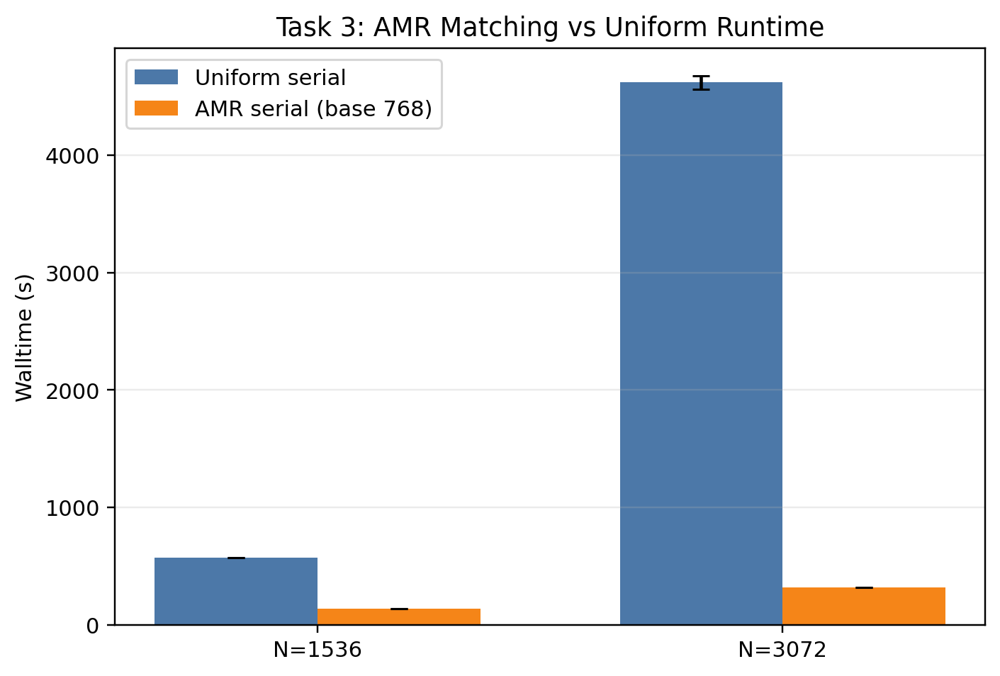
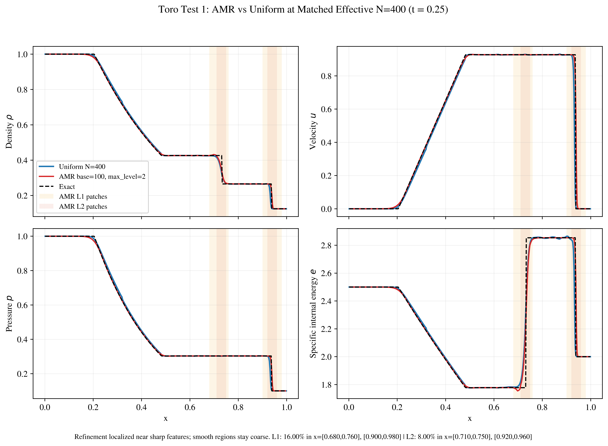

# Adaptive Mesh Refinement and Parallelisation for the Compressible Euler Equations Using AMReX

Finite-volume solver and reproducibility package for a compressible Euler study using [AMReX](https://github.com/AMReX-Codes/amrex). The project evaluates shock-capturing accuracy, adaptive mesh refinement (AMR), and single-node MPI scaling for one- and two-dimensional Euler benchmarks.

This public-facing repository keeps the final AMReX solver, experiment runners, technical report source, report figures, and compact evidence tables. Private submission records and the local AMReX checkout are intentionally excluded from git.

## Report

The final technical write-up is included at the repository root:

- [technical_report.pdf](technical_report.pdf)
- [report/source/main.tex](report/source/main.tex)

## Highlights

- Implemented a 2D compressible Euler solver in C++ on AMReX's block-structured AMR framework.
- Used HLL fluxes with Davis wave-speed bounds, MUSCL/minmod reconstruction, SSPRK2 time stepping, refluxing, and density/pressure positivity safeguards.
- Validated against Toro 1D Riemann problems and 2D orientation/diagonal-split extensions.
- Measured AMR and MPI performance on a Lax-Liu-style quadrant benchmark.
- Final repeated Task 3 result: AMR+MPI at `p=4` reduced time-to-solution by `33.33x` versus the repeated uniform `N=3072` serial baseline on the same laptop.
- Report conclusion is deliberately nuanced: AMR delivered strong runtime gains and credible shock-oriented behavior, but full-field diagnostics did not support a blanket matched-spacing AMR accuracy advantage.

## Selected Results

### AMR Runtime Advantage



### MPI Scaling Saturation


### 1D Validation Example



## Repository Layout

```text
.
|-- solver/                  # Final AMReX C++ solver source and build files
|-- experiments/             # Reproduction scripts, inputs, and analysis code
|   |-- riemann_1d/           # Task 1: Toro Riemann and smooth convergence checks
|   |-- orientation_2d/       # Task 2: orientation and diagonal split tests
|   `-- quadrant_scaling/     # Task 3: AMR/MPI timing and accuracy studies
|-- results/                 # Frozen report figures and compact evidence tables
|-- report/                  # LaTeX report source and report figures
|-- docs/                    # Project summary and notes
|-- technical_report.pdf     # Final technical report
|-- Makefile                 # Build, check, and clean helpers
|-- reproduce_report_data.sh # Full report-data reproduction workflow
`-- requirements.txt
```

## Requirements

- C++17 compiler
- MPI C++ and Fortran wrappers, such as `mpicxx` and `mpif90`
- GNU Make
- Python 3 with `numpy` and `matplotlib`
- AMReX checkout or installation

Install Python dependencies:

```bash
python3 -m pip install -r requirements.txt
```

Fetch AMReX beside the repository, or point `AMREX_HOME` to an existing AMReX checkout:

```bash
git clone https://github.com/AMReX-Codes/amrex.git ../amrex
export AMREX_HOME="$(pwd)/../amrex"
```

## Build

```bash
make build AMREX_HOME="$AMREX_HOME"
```

This creates:

```text
solver/build/main2d.gnu.MPI.ex
```

Generated executables and AMReX build object trees are ignored by git.

## Reproducing The Report Workflows

The full workflow rebuilds the solver and runs the report-data campaigns:

```bash
./reproduce_report_data.sh
```

The high-resolution Task 3 timing scripts are expensive. The frozen outputs used in the written report are already included in `results/`.

Individual workflows can also be run from a built tree. The scripts write self-contained result directories under their experiment folders.

```bash
# Task 1: 1D Riemann validation and smooth convergence checks
cd experiments/riemann_1d
./scripts/run_toro1d_uniform_amr.sh
./scripts/run_smooth_entropy_convergence.sh

# Task 2: 2D orientation and diagonal tests
cd ../orientation_2d
./scripts/run_task2_2d_fullmatrix_report.sh

# Task 3: quadrant timing and accuracy studies
cd ../quadrant_scaling
./scripts/run_task3_quadrant_matrix.sh
./scripts/run_task3_highres_refresh.sh
./scripts/run_task3_accuracy_refresh.sh
./scripts/run_task3_diagnostics.sh
```

## Verification Performed

- Built the final solver successfully against the local AMReX checkout.
- Ran Python bytecode checks for analysis scripts.
- Ran shell syntax checks for task runner scripts.
- Confirmed the local final report contains the latest `33.33x` Task 3 repeated-configuration result.
- Regenerated the public PDF from the cleaned LaTeX source.
- Removed build products, logs, caches, old drafts, audit files, and private submission evidence from the tracked repo.

## Project Summary

Built and evaluated a C++/MPI compressible Euler solver on AMReX with AMR, HLL fluxes, MUSCL reconstruction, SSPRK2 time integration, and positivity safeguards; validated against 1D/2D shock benchmarks and demonstrated a `33.33x` repeated AMR+MPI speedup over a matched uniform-grid serial baseline.
